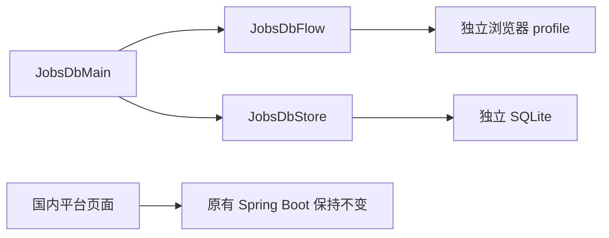
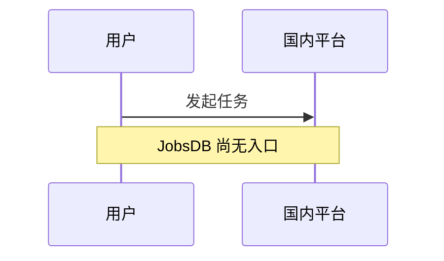
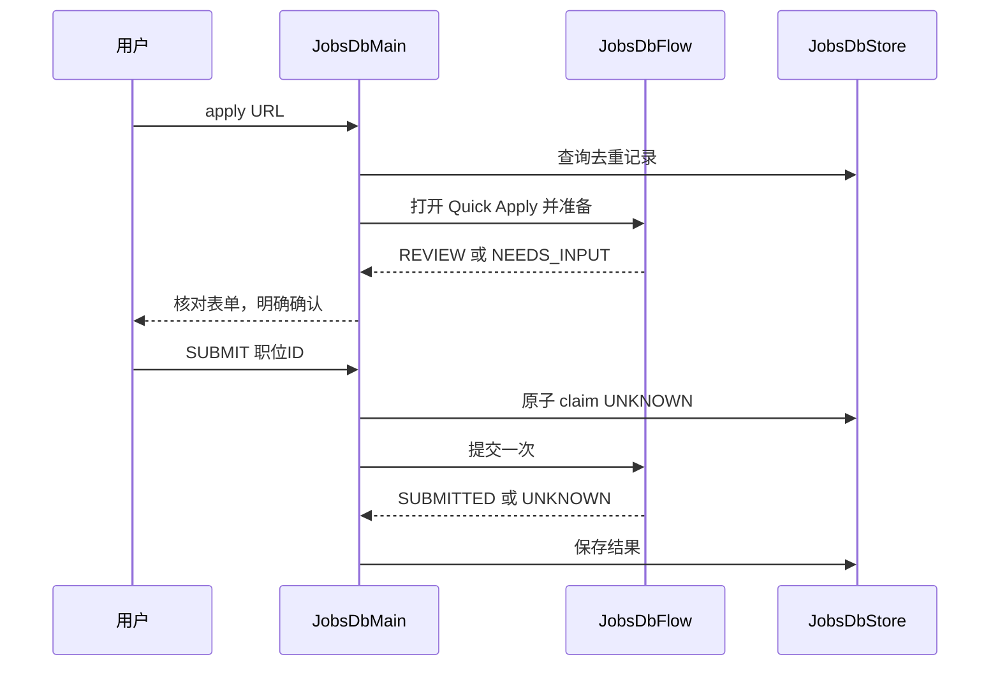
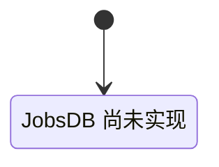
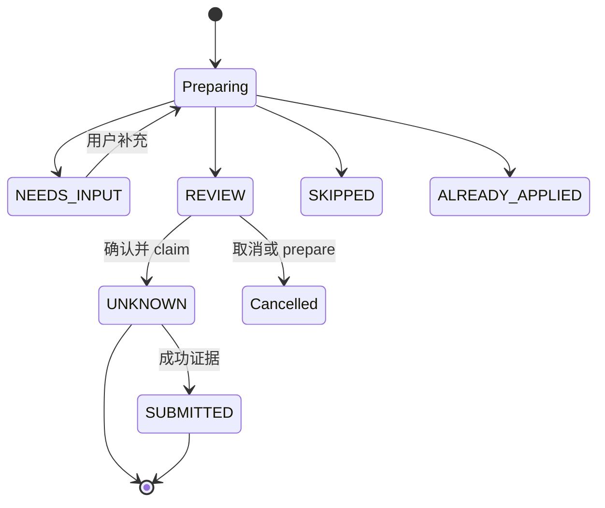
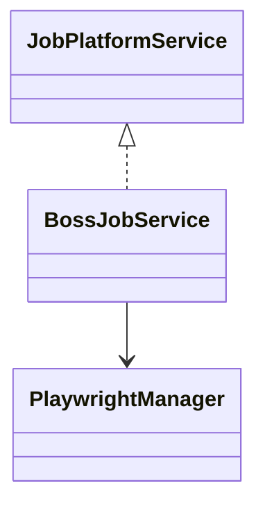
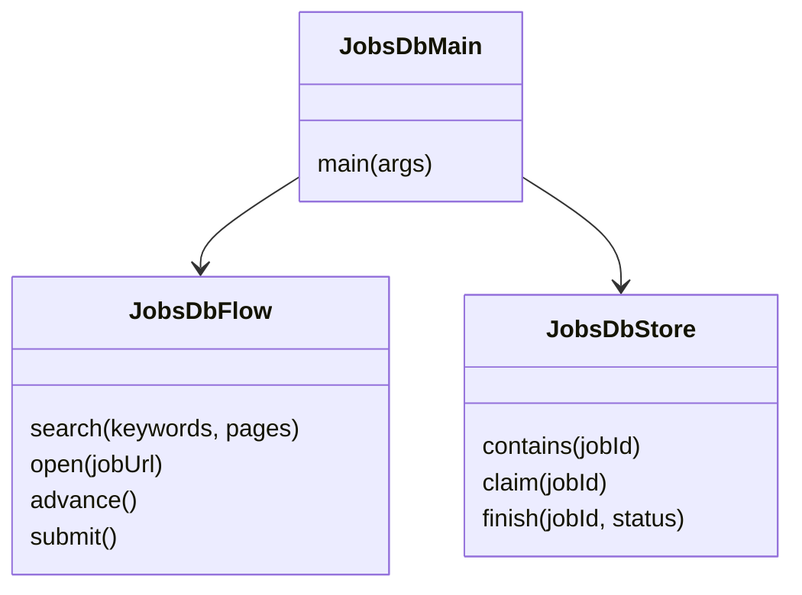

# JobsDB 局部设计
## 当前架构

```mermaid
flowchart LR
  UI[国内平台页面] --> Spring[Spring Boot]
  Spring --> Manager[共享 PlaywrightManager]
  Manager --> Boss[Boss 等平台]
```
## 目标架构

```mermaid
flowchart LR
  CLI[JobsDbMain] --> Flow[JobsDbFlow]
  CLI --> Store[JobsDbStore]
  Flow --> Browser[独立浏览器 profile]
  Store --> DB[独立 SQLite]
  UI[国内平台页面] --> Spring[原有 Spring Boot 保持不变]
```
## 当前时序

```mermaid
sequenceDiagram
  participant U as 用户
  participant B as 国内平台
  U->>B: 发起任务
  Note over U,B: JobsDB 尚无入口
```
## 目标时序

```mermaid
sequenceDiagram
  participant U as 用户
  participant C as JobsDbMain
  participant F as JobsDbFlow
  participant S as JobsDbStore
  U->>C: apply URL
  C->>S: 查询去重记录
  C->>F: 打开 Quick Apply 并准备
  F-->>C: REVIEW 或 NEEDS_INPUT
  C-->>U: 核对表单，明确确认
  U->>C: SUBMIT 职位ID
  C->>S: 原子 claim UNKNOWN
  C->>F: 提交一次
  F-->>C: SUBMITTED 或 UNKNOWN
  C->>S: 保存结果
```
## 当前状态

```mermaid
stateDiagram-v2
  [*] --> Absent
  Absent: JobsDB 尚未实现
```
## 目标状态

```mermaid
stateDiagram-v2
  [*] --> Preparing
  Preparing --> NEEDS_INPUT
  NEEDS_INPUT --> Preparing: 用户补充
  Preparing --> REVIEW
  Preparing --> SKIPPED
  Preparing --> ALREADY_APPLIED
  REVIEW --> UNKNOWN: 确认并 claim
  UNKNOWN --> SUBMITTED: 成功证据
  REVIEW --> Cancelled: 取消或 prepare
  UNKNOWN --> [*]
  SUBMITTED --> [*]
```
## 当前类图

```mermaid
classDiagram
  class JobPlatformService
  class BossJobService
  class PlaywrightManager
  JobPlatformService <|.. BossJobService
  BossJobService --> PlaywrightManager
```
## 目标类图

```mermaid
classDiagram
  class JobsDbMain {
    main(args)
  }
  class JobsDbFlow {
    search(keywords, pages)
    open(jobUrl)
    advance()
    submit()
  }
  class JobsDbStore {
    contains(jobId)
    claim(jobId)
    finish(jobId, status)
  }
  JobsDbMain --> JobsDbFlow
  JobsDbMain --> JobsDbStore
```
