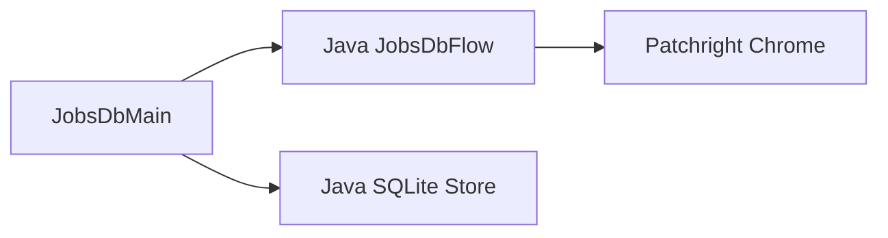
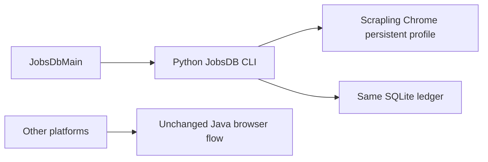
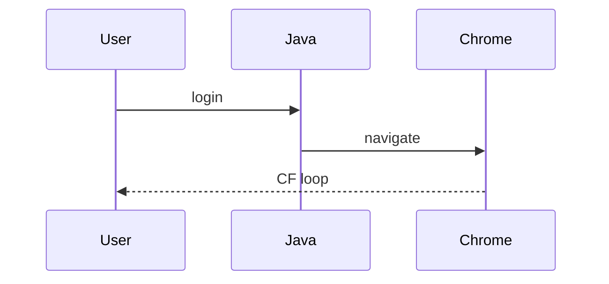
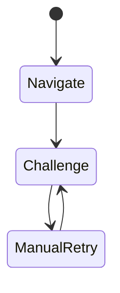
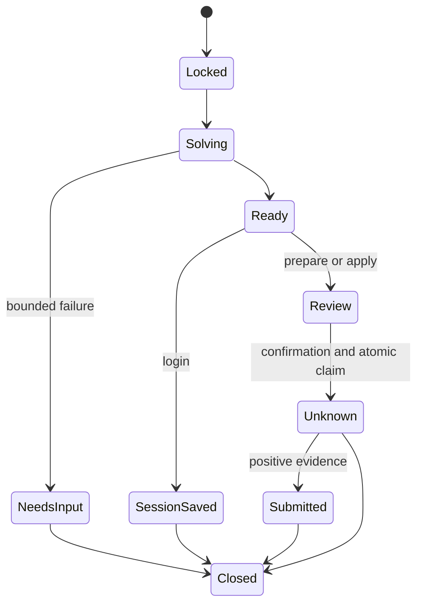
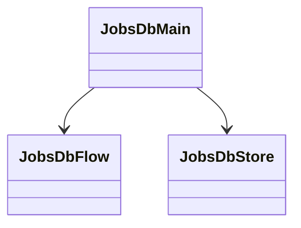
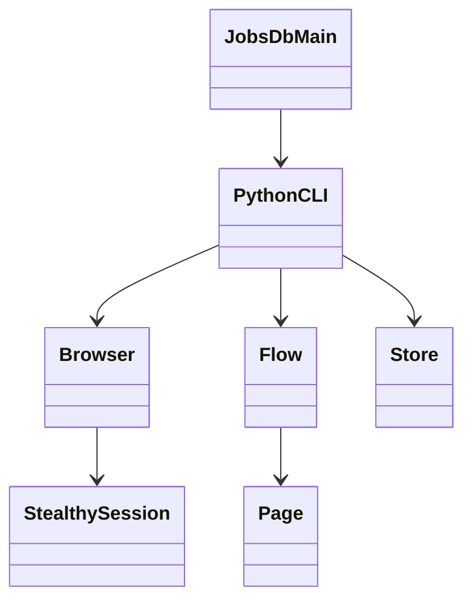

# JobsDB Scrapling 接入（固定点 7d0813f）
仅迁移 JobsDB CLI。Java Interface 为原命令参数与子进程退出码；Python Module 独占浏览器、DOM 与账本知识，不引入 RPC/HTTP 服务、不保留两份投递实现。登录与申请人工确认沿用现有合同；批量调度另行实现。

## 当前架构

## 目标架构

## 当前时序

## 目标时序
```mermaid
sequenceDiagram
  User->>Java: jobsdb login
  Java->>Python: args and inherited terminal
  Python->>Scrapling: persistent session and solve_cloudflare
  Scrapling-->>User: JobsDB login page
  User->>Python: Enter after login
  Python->>Python: preserve profile and close; login status unasserted
  Python-->>Java: exit status
```
## 当前状态

## 目标状态

## 当前类图

## 目标类图


## 验收
- 原 jobsdb login/search/prepare/apply/history/help 命令接入新实现，不留下旧浏览器路径。
- 独立 profile、锁、原 SQLite 表和 UNKNOWN 去重保持；不启动 Boss/Spring/前端。
- 登录会话跨进程保留；登录状态未验证不得声称已登录；EOF 不表示确认。
- CF 自动处理有超时；Scrapling action 异常不被吞掉；提交不自动重试。
- 无账号 fixture 覆盖原申请合同、持久化、锁、Java 转发；真实搜索从正式 Java 入口通过 CF。
- 文档、安装命令、回滚与验证记录；独立 Standards/Spec review；推送原 PR。
